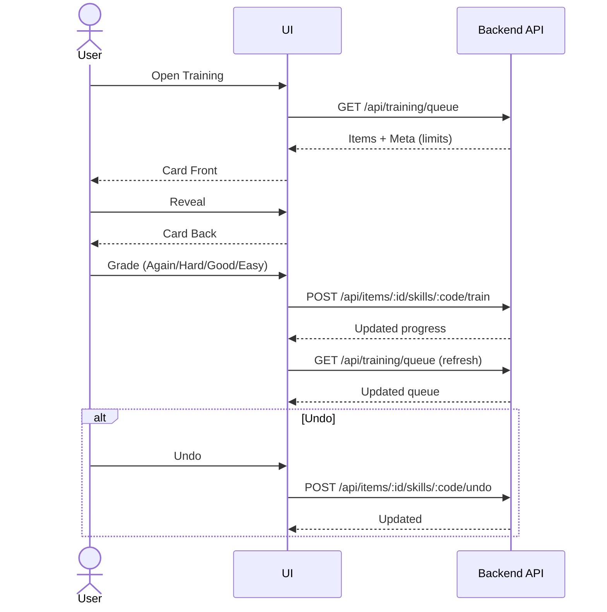

# Information Architecture and Core Flows (Phase 1)

## Sitemap (MVP)

```mermaid
graph TD
  A[App Root (Auth)] --> B[Dex Grid]
  A --> C[Training Session]
  A --> D[Progress Dashboard]
  A --> E[Preferences]

  B --> B1[Search]
  B --> B2[Filters (Kind/HSK/Tags/Strokes)]
  B --> B3[Sort]
  B --> F[Character Detail Modal]

  F --> F1[Overview]
  F --> F2[Strokes]
  F --> F3[Components]
  F --> F4[Examples]
  F --> F5[Stats]
  F -->|Catch/Discover| B
```

## Training Flow (Reveal → Grade)



## Core Entities (MVP)
- Item: `id, value, kinds[], display_pinyin, english_definition, hsk_level, components[], radicals_contained[], stroke_count`
- Skill Progress: `level, last_trained_at, due_at, stability, difficulty, suspended`
- Review Event: `reviewed_at, rating_label, rating_value, duration_ms`

## Filters / Sort
- Filters: kind (character/word/radical), HSK (1..6/7), stroke count range, tags
- Sort: HSK asc, frequency desc, last seen desc, due status (red/amber/green)
